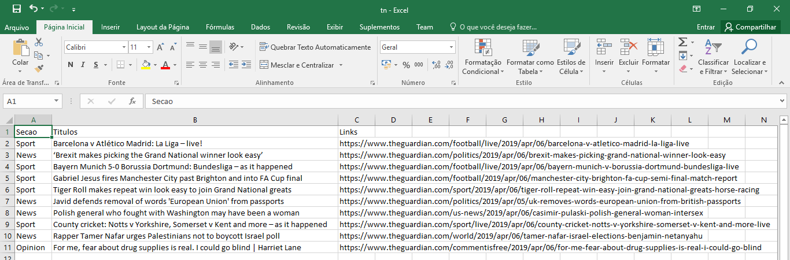

<!-- 
 --> 

<!-- Para adicionar um comentário, seleciona o que quer e digita : ctrl + ; -->

# Noticias The Guardian
Script modularizado para buscar ultimas noticias do the guardian pela API exportando para csv algumas categorias
  - Arts
  - News
  - Sports

API utilizada: [The Guardian API](https://open-platform.theguardian.com/access/)

### Bibliotecas para Funcionamento do Script
``` sh
pip install requests
```
``` sh
pip install json
```
``` sh
pip install pandas
```


### Funções Utilizadas

``` sh
$ main()
$ exportar_csv(s, t, l, nome_arq)
$ buscar_noticia(dados)
```

### Comandos do Git

``` sh

Abre Página - github
Clica no botão superio direito no +
Da um nome e descrição Projeto (Public)
Marca opção inicialize this repository with README
Clica Create Repository

Vai para a pasta onde estão os arquivos
Clica com Botão Direito e seleciona Git Bahs Here
Irá Abrir uma Janela
Digita ---> git init
---> git status
---> git add .
---> git commit -m "Comentario da Alteração"
---> Volta na pagina do github
     Clica no botão -> Clone or Download
     Copia a url que aparece na caixa

Volta na Janela aberta no git bahs here
---> git remote add origin e a url copiada no github
---> git push origin master

Se der ERRO ---> gitt pull --rebase origin master
            ---> git push origin master

Depois se houver outras alterações em sequência
---> git status
---> git add .
---> git commit -m "Comentario da Alteração"
---> git push origin master

```

### Arquivo Gerado



### Desenvolvedor

 - Anderson Nogueira

License
----
**Free Software!** A documentação está armazenada [aqui](https://github.com/Anderson-Nogueira/noticia-theguardian)


